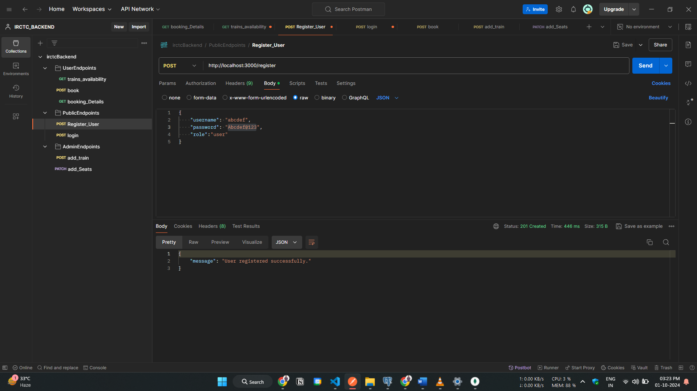
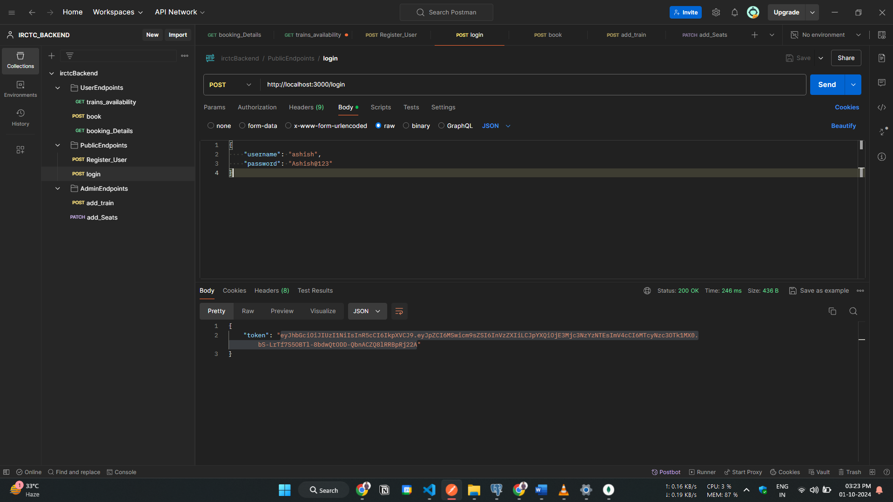
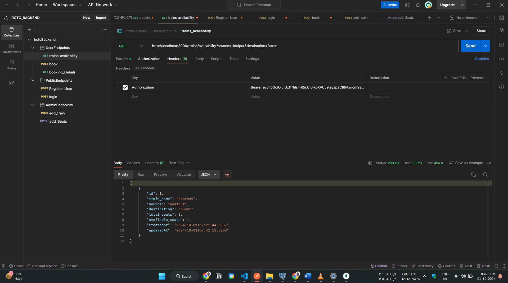
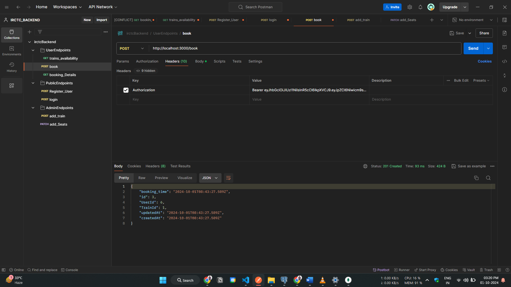
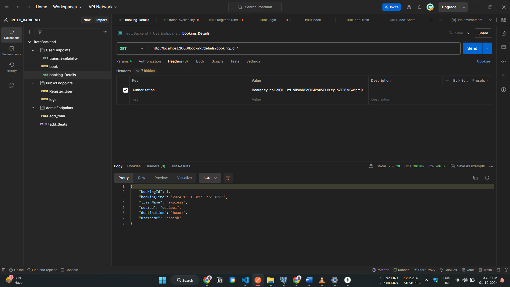
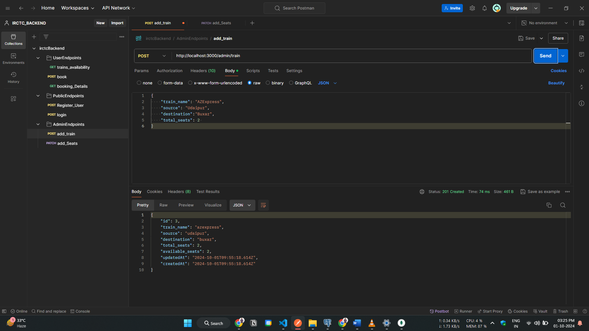
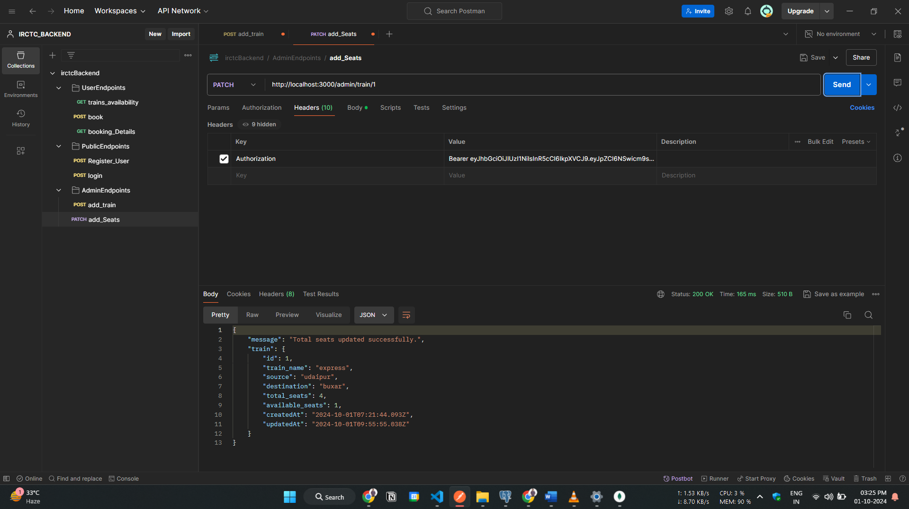

<div align="center">

# 🚄 IRCTC Backend System 🚄

<i>A Node.js-powered backend system designed to streamline train seat bookings and schedule management for both users and administrators.</i>

</div>

---

## 🛠️ Tech Stack

<div align="center">


</div>

---

## 🚀 Key Features

- **User Authentication**: Secure login and registration functionality for users using JWT.
- **Train Management**: Admins can add trains and update seating capacities.
- **Seat Booking**: Users can check seat availability and book seats on trains.
- **Booking Details**: Retrieve booking details easily with available API endpoints.

---

## 🛠️ Getting Started

### Prerequisites

- **Node.js**: Ensure you have Node.js installed.
- **PostgreSQL**: Ensure PostgreSQL is running locally or on Docker.

### Installation

#### 1. Clone the repository

```bash
git clone https://github.com/mayank2808sharma/IRCTC-backend
cd IRCTC-backend
```

**2. Install Dependencies**

```bash
npm i
```

**3. Set Up Environment Variables**

Create a `.env `file in the root directory and update it with your database and authentication configurations as follows:

```bash
PORT= 3000
DB_HOST = hostname
DB_USER = username for the database
DB_PASSWORD = password for the database
DB_NAME = name of the database
JWT_SECRET = secret key used to sign and verify JSON Web Tokens
```

**4. Database Setup**

Make sure your PostgreSQL database is running and the credentials in .env match your database info. Run the following command to set up your database tables:

```bash
npm run setdb
```

**5. Start the Server**

```bash
npm start
```

This will start the server on `http://localhost:3000`.

# API Endpoints 📚

## Public Endpoints

- **POST /register** - Register a new user </br>
  Request Body: </br>

```json
{
  "username": "ashish",
  "password": "Ashish@123",
  "role": "user"
}
```



- **POST /login** - Login a user</br>
  Request Body: </br>

```json
{
  "username": "ashish",
  "password": "Ashish@123"
}
```



## User Endpoints

- **GET /trains/availability** - Fetch available trains </br>
  Query Parameters:</br>
  `source=CityA&destination=CityB`
  
- **POST /book** - Book ticket </br>
  Request Body: </br>

```json
{
  "train_id": 1
}
```



- **GET /booking/details** - Get specific booking details</br>
  Query Parameters:</br>
  `booking_id=1`
  

## Admin Endpoints

- **POST /admin/train** - Add a new train</br>
  Request Body: </br>

```json
{
  "train_name": "Express",
  "source": "Udaipur",
  "destination": "Buxar",
  "total_seats": 2
}
```



- **PATCH /admin/train/:trainId** - Increase number of total seats</br>
  Request Body: </br>

```json
{
  "add_seats": 1
}
```



# 🚀 Running Tests

To run tests for your API endpoints, use Postman or any API testing tool. Ensure the server is running before testing the endpoints.

I have exported the Postman collections in `irctcBackend.postman_collection.json` and included them in the repository. You can import the JSON file and try the endpoints easily.
